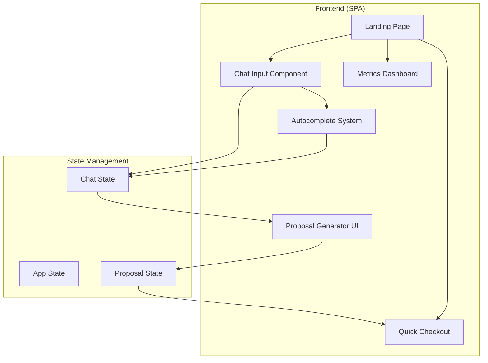

# Design Document: eldar.marketing Landing Page

## Overview

Современный минималистичный лендинг для маркетингового агентства eldar.marketing с инновационным UX: интерактивный чат с автокомплитом, генерация предложения в реальном времени и быстрый путь к оплате. Весь путь клиента — 5-10 минут от входа до решения.

Ключевая идея: "дорогой" сервис = экономия времени клиента через автоматизацию и предугадывание потребностей.

## Architecture



### Технологический стек

- **Framework**: Vanilla JS + HTML5 + CSS3 (минимальные зависимости для скорости)
- **Styling**: CSS Custom Properties + Flexbox/Grid
- **Animations**: CSS Animations + requestAnimationFrame
- **Fonts**: Inter (Google Fonts) — современный, читаемый, бесплатный
- **Icons**: Lucide Icons (SVG, MIT license)

## Components and Interfaces

### 1. Landing Page Layout

```
┌─────────────────────────────────────────────────────────┐
│  HEADER: Logo eldar.marketing                           │
├─────────────────────────────────────────────────────────┤
│                                                         │
│  HERO SECTION                                           │
│  ┌─────────────────────────────────────────────────┐   │
│  │  "Расскажите, что вам нужно"                    │   │
│  │  ┌─────────────────────────────────────────┐    │   │
│  │  │ 🔍 Нужна реклама в...                   │    │   │
│  │  └─────────────────────────────────────────┘    │   │
│  │  ┌─ Autocomplete suggestions ──────────────┐    │   │
│  │  │ • Нужна реклама в Instagram             │    │   │
│  │  │ • Нужна реклама в Яндекс.Директ         │    │   │
│  │  │ • Нужен лендинг для бизнеса             │    │   │
│  │  └─────────────────────────────────────────┘    │   │
│  └─────────────────────────────────────────────────┘   │
│                                                         │
├─────────────────────────────────────────────────────────┤
│  PROPOSAL SECTION (появляется после отправки запроса)   │
│  ┌─────────────────────────────────────────────────┐   │
│  │  ✓ Анализируем ваш запрос...                    │   │
│  │  ✓ Подбираем оптимальное решение...             │   │
│  │  ▸ Рассчитываем стоимость...                    │   │
│  │                                                  │   │
│  │  Итого: 45 000 ₽ | Срок: 5 дней                 │   │
│  │  [Мы уже знаем что вам нужно — Оплатить]        │   │
│  └─────────────────────────────────────────────────┘   │
│                                                         │
├─────────────────────────────────────────────────────────┤
│  METRICS SECTION (минималистичные графики)              │
│  ┌──────────┐  ┌──────────┐  ┌──────────┐              │
│  │ 150+     │  │ 3.2x     │  │ 48ч      │              │
│  │ проектов │  │ ROI      │  │ старт    │              │
│  └──────────┘  └──────────┘  └──────────┘              │
│                                                         │
├─────────────────────────────────────────────────────────┤
│  FOOTER: Контакты | © eldar.marketing                   │
└─────────────────────────────────────────────────────────┘
```

### 2. Chat Input Component

```typescript
interface ChatInputProps {
  placeholder: string;
  suggestions: string[];
  onSubmit: (query: string) => void;
}

interface ChatInputState {
  value: string;
  filteredSuggestions: string[];
  isOpen: boolean;
  selectedIndex: number;
}
```

**Поведение:**
- Фокус на поле при загрузке страницы
- Фильтрация подсказок при вводе (fuzzy match)
- Навигация стрелками по подсказкам
- Enter — отправка или выбор подсказки
- Escape — закрытие списка

### 3. Autocomplete System

```typescript
interface AutocompleteConfig {
  suggestions: ServiceSuggestion[];
  maxVisible: number;
  minChars: number;
}

interface ServiceSuggestion {
  id: string;
  text: string;
  category: 'advertising' | 'development' | 'analytics' | 'branding';
  keywords: string[];
}
```

**Предустановленные запросы:**
1. "Нужна реклама в Instagram/Facebook"
2. "Нужна реклама в Яндекс.Директ"
3. "Нужна реклама в Google Ads"
4. "Нужен лендинг для бизнеса"
5. "Нужен интернет-магазин"
6. "Нужна SEO-оптимизация сайта"
7. "Нужна настройка аналитики"
8. "Нужен ребрендинг"
9. "Нужна SMM-стратегия"
10. "Нужна email-рассылка"

### 4. Proposal Generator

```typescript
interface ProposalStep {
  id: string;
  text: string;
  duration: number; // ms
  status: 'pending' | 'active' | 'complete';
}

interface Proposal {
  query: string;
  steps: ProposalStep[];
  result: {
    price: number;
    duration: string;
    includes: string[];
  };
}
```

**Шаги генерации:**
1. "Анализируем ваш запрос..." (2 сек)
2. "Подбираем оптимальное решение..." (3 сек)
3. "Рассчитываем стоимость..." (2 сек)
4. Показ результата с анимацией

### 5. Metrics Dashboard

```typescript
interface Metric {
  id: string;
  value: string;
  label: string;
  icon?: string;
}
```

**Метрики:**
- 150+ завершённых проектов
- 3.2x средний ROI клиентов
- 48ч до старта работ
- 98% клиентов возвращаются

### 6. Quick Checkout

```typescript
interface CheckoutState {
  proposal: Proposal;
  step: 'review' | 'payment' | 'success';
  paymentMethod: 'card' | 'invoice';
}
```

## Data Models

### AppState

```typescript
interface AppState {
  currentView: 'chat' | 'proposal' | 'checkout';
  chat: {
    query: string;
    suggestions: ServiceSuggestion[];
    isTyping: boolean;
  };
  proposal: {
    isGenerating: boolean;
    currentStep: number;
    result: ProposalResult | null;
  };
  checkout: {
    isOpen: boolean;
    status: 'idle' | 'processing' | 'success' | 'error';
  };
}
```

### ServiceCatalog

```typescript
interface ServiceCatalog {
  services: Service[];
}

interface Service {
  id: string;
  name: string;
  category: string;
  basePrice: number;
  baseDuration: string;
  description: string;
}
```

## Correctness Properties

*A property is a characteristic or behavior that should hold true across all valid executions of a system—essentially, a formal statement about what the system should do. Properties serve as the bridge between human-readable specifications and machine-verifiable correctness guarantees.*

### Property 1: Autocomplete filtering returns relevant suggestions

*For any* input string entered by the user, the filtered suggestions returned by the Autocomplete_System should be a subset of all available suggestions, and each returned suggestion should contain the input string (case-insensitive match) or match by keywords.

**Validates: Requirements 1.1, 1.5**

### Property 2: Suggestion selection populates input field

*For any* suggestion selected from the autocomplete list, the Chat_Input field value should exactly equal the selected suggestion text.

**Validates: Requirements 1.2**

### Property 3: Query submission triggers proposal generation

*For any* non-empty query submitted via Enter or button click, the Proposal_Generator should be invoked with that exact query string.

**Validates: Requirements 1.3**

### Property 4: Completed proposal contains price and duration

*For any* completed proposal generation, the result object should contain a valid price (number > 0) and a non-empty duration string.

**Validates: Requirements 2.3**

### Property 5: Checkout state transitions correctly

*For any* formed proposal, clicking the payment button should transition the checkout state from 'review' to 'payment', and successful payment should transition to 'success' state.

**Validates: Requirements 4.1, 4.2, 4.4**

## Error Handling

### Input Validation
- Empty queries: Prevent submission, show subtle hint
- Very long queries (>500 chars): Truncate with notification
- Special characters: Sanitize to prevent XSS

### Network Errors
- Proposal generation timeout: Show retry button after 30s
- Payment failure: Display error message with retry option
- Connection lost: Show offline indicator, queue actions

### State Recovery
- Browser refresh during proposal: Restore from sessionStorage
- Payment interruption: Provide order status check

## Testing Strategy

### Unit Tests
- Autocomplete filtering logic
- Proposal step progression
- State transitions
- Input validation

### Property-Based Tests
Использовать **fast-check** для JavaScript property-based testing.

Конфигурация: минимум 100 итераций на тест.

Каждый тест должен быть аннотирован:
```javascript
// Feature: eldar-marketing-landing, Property N: [property text]
```

### Integration Tests
- Full user flow: input → autocomplete → submit → proposal → checkout
- Mobile responsiveness
- Cross-browser compatibility

### Visual Tests
- Screenshot comparison for key states
- Animation timing verification

